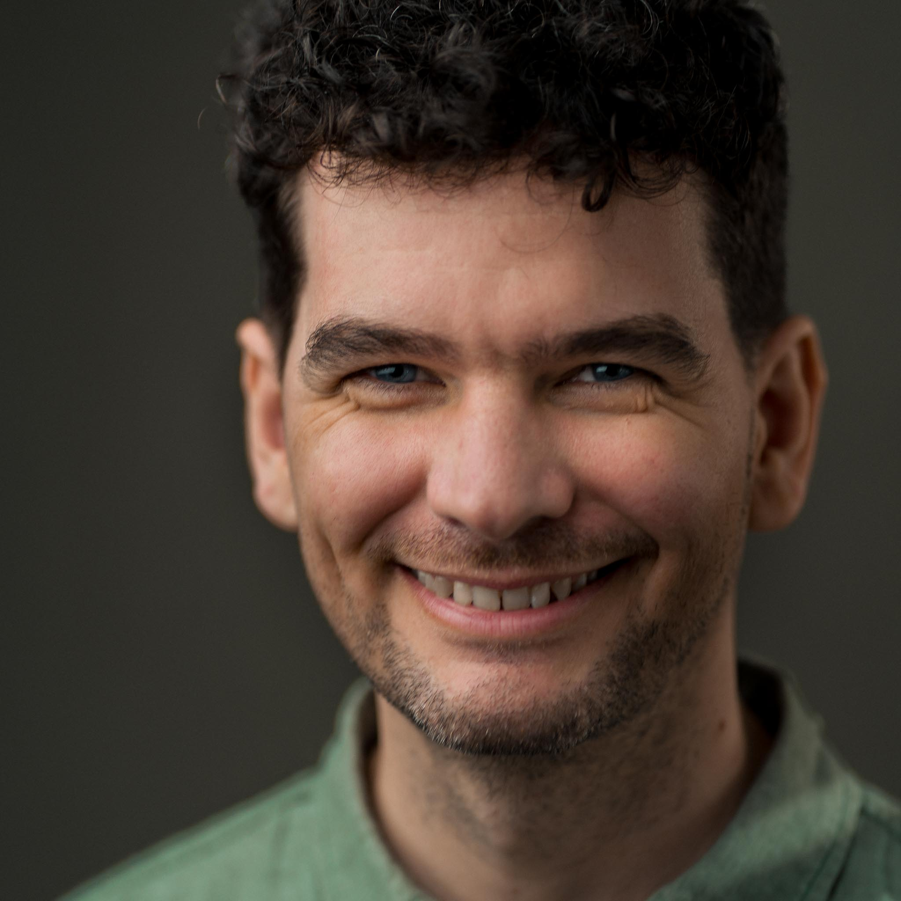

# About

Hi, my name is Anthony. I'm a lighting designer for live performance based in London. 
I am originally from [Ngunnawal and Ngambri Country, Australia](/about/aoc). 

## About Anthony
I started this PhD in 2025, while continuing teaching at the [Royal Academy of Dramatic Art](https://rada.ac.uk), in London. I teach lighting design, production electrics and programming on the Academy's practice-based courses. 
After completing a Bachelor of Arts and Bachelor of Laws at the [Australian National University](https://anu.edu.au), I moved to London. In 2012 I completed a Postgraduate Diploma in Stage Electrics and Lighting Design at RADA. 

I live and work in London as an educator and Lighting Designer. You can find out more about me and my Lighting Design work, at [anthonyarblaster.com.](https://anthonyarblaster.com)

Or you can follow me on social media:



## About the PhD
The preliminary title is: **Towards a Light Dramaturgy: Techniques and Practice of Dramaturgy as Lighting Design**

This PhD is by creative practice through the School of Arts and Creative Technologies at the University of York.
It is supervised by [Dr Katherine Graham](https://www.york.ac.uk/arts-creative-technologies/people/katherine/) and [Dr Rebecca Benzie](https://www.york.ac.uk/arts-creative-technologies/people/rebecca-benzie/), both at the School of ACT. 

The PhD focuses on developing a dramaturgical tool kit for lighting designers to use while creating work. 
It isn't focused on the final product – rather it aims to be a tool for practice. 

The PhD will be undertaken through practice-based research which will ensure that my arts practice sits inside and around the research.

You can find out more about the [PhD in Theatre, Film, Television and Interactive Media (by creative practice)](https://www.york.ac.uk/arts-creative-technologies/study/theatre-film-television-research-degrees/phd-theatre-film-tv-interactive-media-by-creative/) on the University of York website.

## About This Site
This webpage will be the repository for shared documents, tools and information arrising out of the PHD. 
The exact shape of this site will come into focus as I move through the early stages of the PhD.

### Problems and Improvements
The site is built using GitHub Pages, and is hosted [@aarblaster/light-dramaturgy](https://github.com/aarblaster/light-dramaturgy), where you can [report an issue](https://github.com/aarblaster/light-dramaturgy/issues) and view the source code for this site.

### Referencing
This project is archived using [Zenodo](https://zenodo.org) the open repository from CERN. 
To reference this site you can use DOI [10.5281/zenodo.15276039](https://doi.org/10.5281/zenodo.15276039).