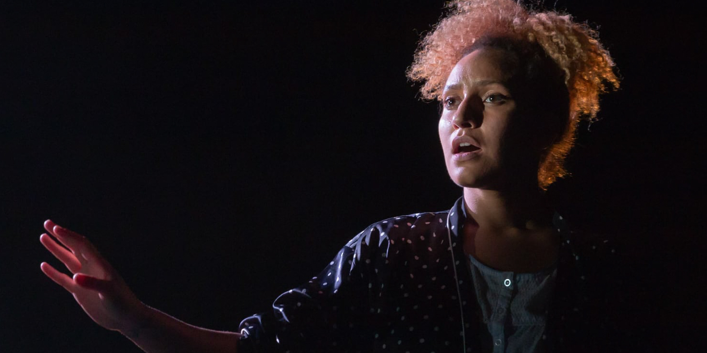

# Welcome

Welcome to Light Dramaturgy. My name is Anthony. This is the home for my PhD at the University of York. 
My PhD focuses on developing tools for performance lighting designers to be dramaturgs. 
The different techniques, approaches and skills that can help to produce a clear story for an audience.

I'm an educator and lighting designer from Ngunnawal and Ngambri Country, Australia. You can find out more about me on my [main site](https://anthonyarblaster.com/about). Or you can find out more about [this project.](https://phd.anthonyarblaster.com/about)

My PhD is just beginning, but as it progresses you can keep up to date with my progress here.

## Links
You can find me in all the usual places on the web including:
- [anthonyarblaster.com](https://anthonyarblaster.com) for my design and teaching;
- [codebyanthony.com](https://codebyanthony.com) for my apps and software;
- [0009-0005-0404-0645](https://orcid.org/0009-0005-0404-0645) is my ORCID number;
- or you can find [all my links here](https://anthonyarblaster.com/linktree).

